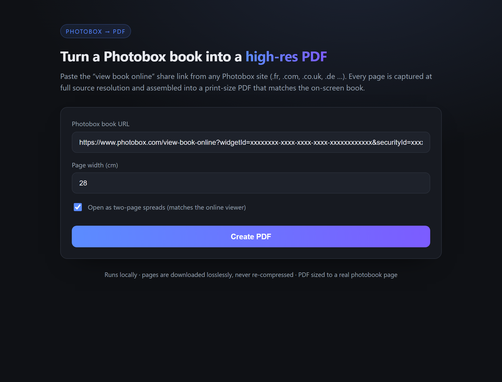

# Photobox Book → PDF

Turn a Photobox "voir le livre en ligne" share link into a **high-resolution, print-size PDF**
that matches the book you see on screen — no login required.

<p align="center">
  <em>Paste the share link → get a pixel-perfect PDF + every page as a JPG.</em>
</p>

<p align="center">
  
</p>

Works with any Photobox storefront — `photobox.fr`, `photobox.com`, `photobox.co.uk`,
`photobox.de`, `photobox.es`, `photobox.it`, `photobox.nl`, `photobox.be`, and friends.

## How it works

Photobox renders its online books inside a viewer that loads each page as a flat JPEG from S3
(`HPage_front`, `HPage_001` … `HPage_NNN`, `HPage_back`). The app:

1. **Opens the book** in a headless Chromium browser (Playwright) and lets the viewer preload
   every page, capturing the signed image URLs.
2. **Downloads each page** at its native source resolution and saves it as a high-resolution JPG —
   the bytes are passed through untouched, never re-compressed.
3. **Assembles a PDF** where every page keeps the exact image (embedded losslessly) and each PDF
   page is sized to a real photobook page (default **28 cm** wide, landscape). By default the PDF
   opens as **two-page spreads**, reproducing the on-screen book exactly.

Because the app uses the same flat page images the viewer displays, the result is pixel-perfect —
and actually sharper than a screenshot, which would upscale the same source.

## Usage

### Windows: just double-click `Launch.bat`

`Launch.bat` installs dependencies on first run, starts the server, and opens your browser at
<http://localhost:3000>. The server runs inside that console window — **closing the window (or
pressing Ctrl+C) stops the server and all its child processes, so nothing is left running.**

### Web app (the simple form)

```bash
npm install      # also installs the Chromium browser
npm start        # → http://localhost:3000
```

Open <http://localhost:3000>, paste the book URL, and click **Create PDF**. You'll see live
progress, then a download link for the PDF plus thumbnails of every captured page.

### Command line

```bash
npm run convert -- "https://www.photobox.fr/voir-livre-en-ligne?widgetId=…&securityId=…" [outDir]
```

Outputs `output/book.pdf` and `output/jpg/page_XXX_*.jpg`.

## Options

| Option | Where | Default | Meaning |
| --- | --- | --- | --- |
| Page width (cm) | form / `buildPdf({widthCm})` | `28` | Physical width of each PDF page; height follows the image aspect ratio. |
| Two-page spreads | form / `buildPdf({matchSpreads})` | `on` | Insert the blank inside-cover leaf and open the PDF two-up, matching the online viewer. |

## Project layout

```
server.mjs          Express server + live-progress (SSE) form endpoint
public/index.html   The form UI
src/extract.mjs     Headless-browser page/URL extraction
src/build.mjs       Download pages + assemble the PDF
src/convert.mjs     Full pipeline (also a CLI)
```

## Notes

- The image URLs are time-limited signed S3 links, so the app always extracts fresh URLs at run time.
- Works on any public Photobox book link that contains `widgetId` and `securityId` (or a direct
  `widgetviewer.photoconnector.net` URL).
- Page resolution is whatever the viewer serves (typically 1024 px on the long edge) — that is
  exactly what is visible on screen.
